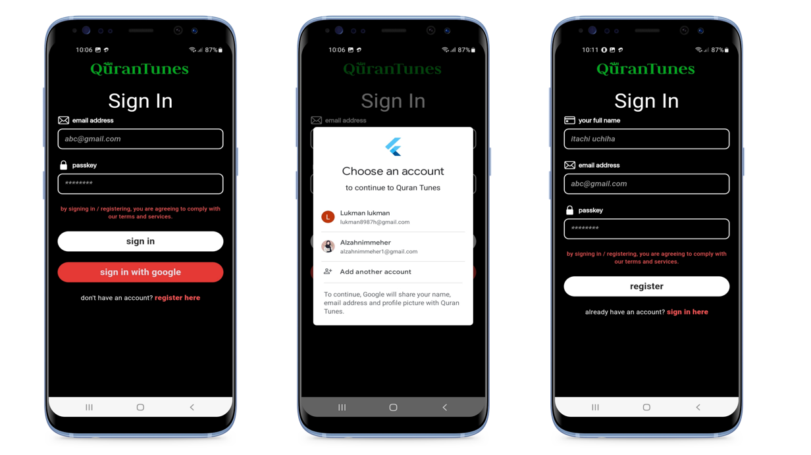

# QuranTunes App

A cross-platform mobile application for listening to Quran recitations, featuring renowned Qaris and Surahs presented in a user-friendly format.

## App Screenshots

Here is a quick look at the app's screenshots:

## App Features

- Splash screen
- User authentication
- User registration with specific user roles 
- 3 dedicated tabs for different Qaris.

- Each Qari features 7 Surahs.

- Intuitive music-like player for seamless listening.

- Offline access using Asset Folder storage.

- Light/Dark Mode for user comfort.

## How to Run the App

To run the app, you'll need to set up Flutter and Dart on your machine.

### Steps:

1. Download Android Studio from the official website: [Android Studio](https://developer.android.com/studio)
2. Download JDK from the official website: [Java SE Development Kit](https://www.oracle.com/java/technologies/javase-jdk11-downloads.html)
3. Download the Flutter SDK from the official website: [Flutter SDK](https://docs.flutter.dev/release/archive)
4. Download SDK version `3.22.1`.
5. Unzip the downloaded Flutter SDK into a directory of your choice.
6. Open Android Studio and install the Flutter & Dart plugins.
7. Set up the Flutter SDK in your system environment variables.
8. Specify the Flutter SDK path in your Android Studio settings.

For detailed instructions, check this [Reference Video](https://youtu.be/mMeQhLGD-og?si=rXZQVFBjGOu12aM8).

### Running the App:

1. Open Android Studio.
2. Select "Project from Version Control (VCS)" and paste the project URL: [GitHub Repository](https://github.com/jannatulferdous2730/quran_tunes.git)
3. The project will be imported into Android Studio.
4. Run the app on an emulator or a physical device.

## Packages Used in This Project

- [http](https://pub.dev/packages/http) - A composable, Future-based library for making HTTP requests.
- [getx](https://pub.dev/packages/get) - GetX is an extra-light and powerful solution for Flutter. It combines high-performance state management, intelligent dependency injection, and route management quickly and practically.
- [fluttertoast](https://pub.dev/packages/fluttertoast) - Toast library for Flutter. Easily create toast messages in a single line of code.
- [awesome_dialog](https://pub.dev/packages/awesome_dialog) - A beautiful and customizable dialog widget for Flutter.
- [google_fonts](https://pub.dev/packages/google_fonts) - Load and use Google Fonts with ease in Flutter.
